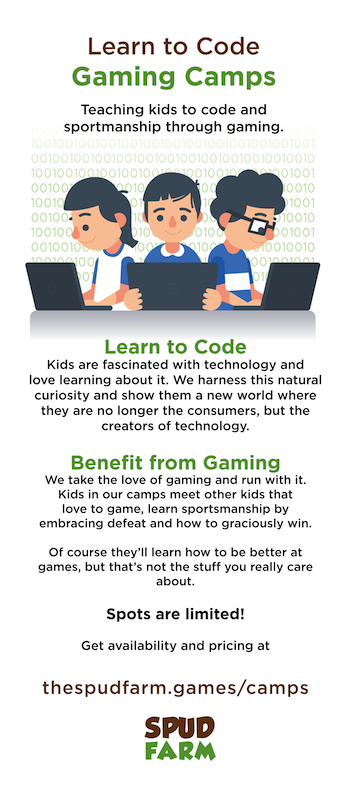

# Spud-Farm-Digital-Assets

#### Digital Assets used at Spud Farm Esports Academy 

#### Posting up the digital assets from the business I closed up earlier this year. When possible I'm posting the source files. This is my gift to the community, offering it under **[unlicense](http://unlicense.org)** I hope someone can do some good with them.

The Spud Farm Esports Academy was located in Edmonton, AB, Canada. We had day camps, home school classes, after school programs, with a focus of computer science and robotics. Competitive video game coaching, and organizing snd hosting of tournaments. Scouting for North American university Esports Programs (one of our students was actually scouted to North Carolina to play League of Legends as a Jungler). 

Hopefully some of these assets can be used by someone to market to a kid who wouldnt have otherwise found the class he needed to become the next great developer.

**Why unlicense?** Well... to quote unlicense.org

> ## Why Use the Unlicense?
> Because you have more important things to do than enriching lawyers or imposing petty restrictions on users of your code. How often have you passed up on utilizing and contributing to a great software library just because its open source license was not compatible with your own preferred flavor of open source? How many precious hours of your life have you spent deliberating how to license your software or worrying about licensing compatibility with other software? You will never get those hours back, but here's your chance to start cutting your losses. Life's too short, let's get back to coding.

Heres an idea of what the content looks like:

